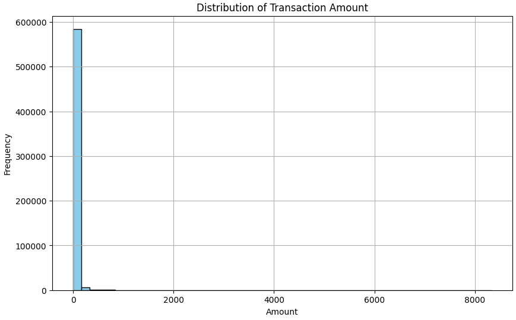
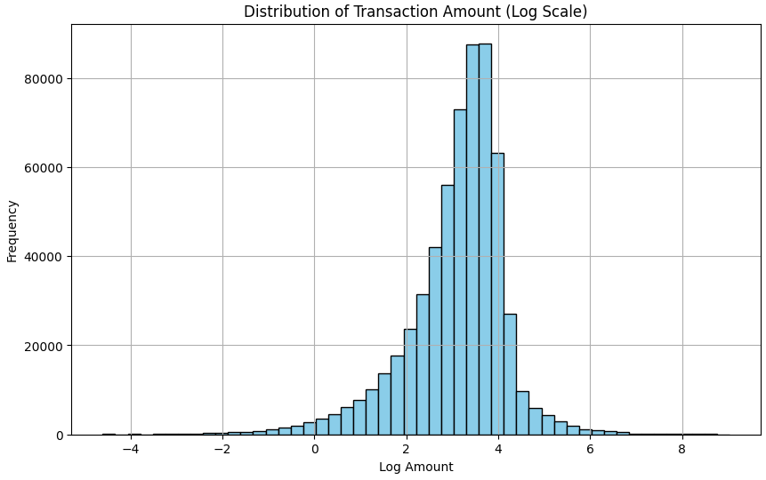
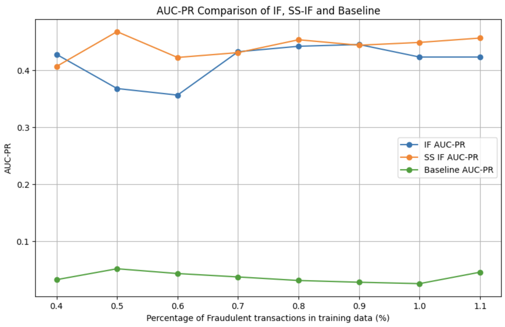
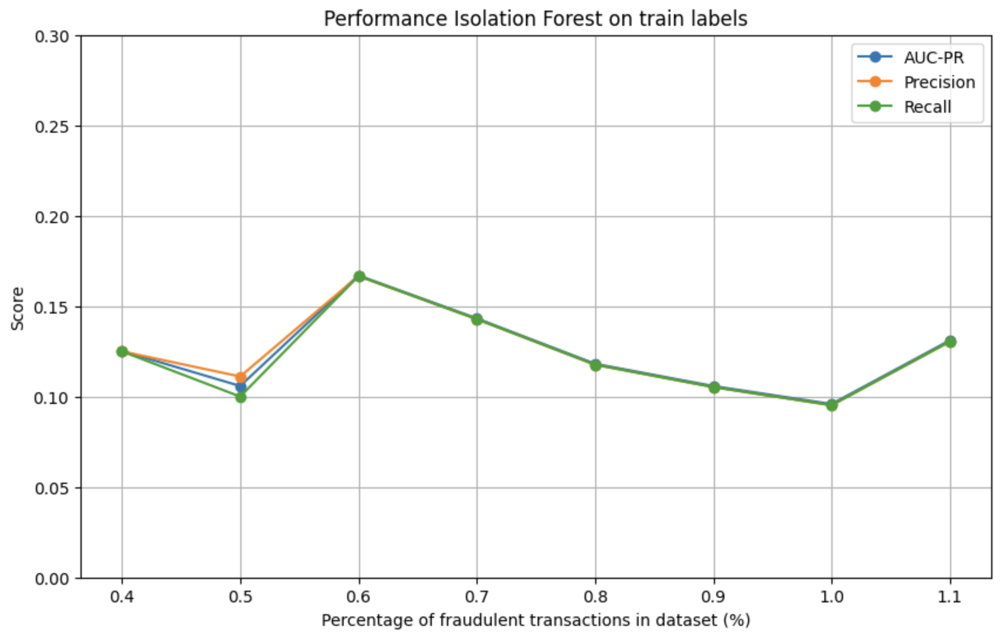
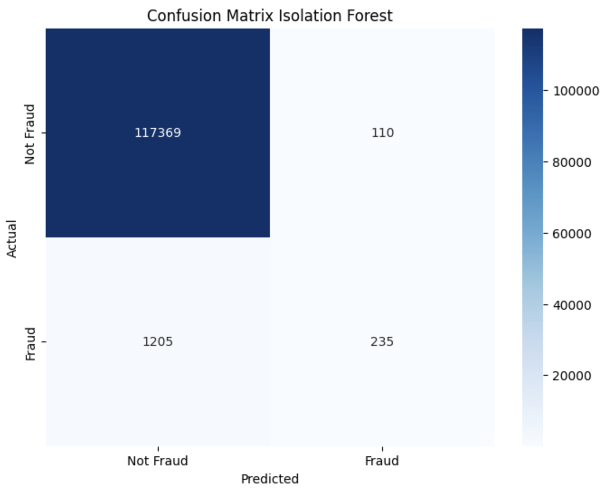
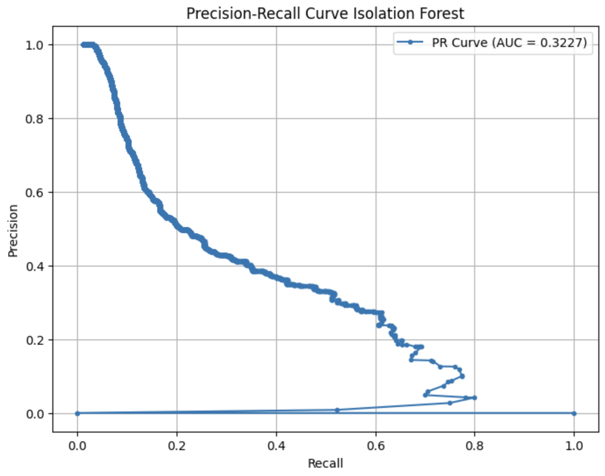
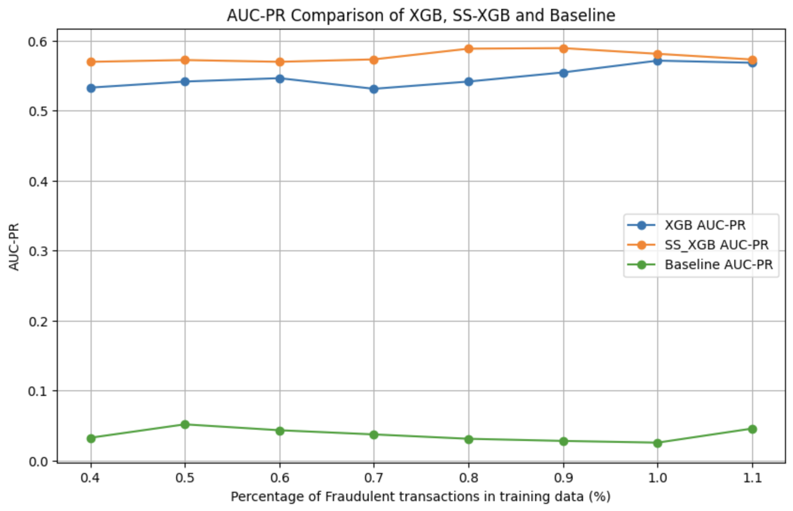
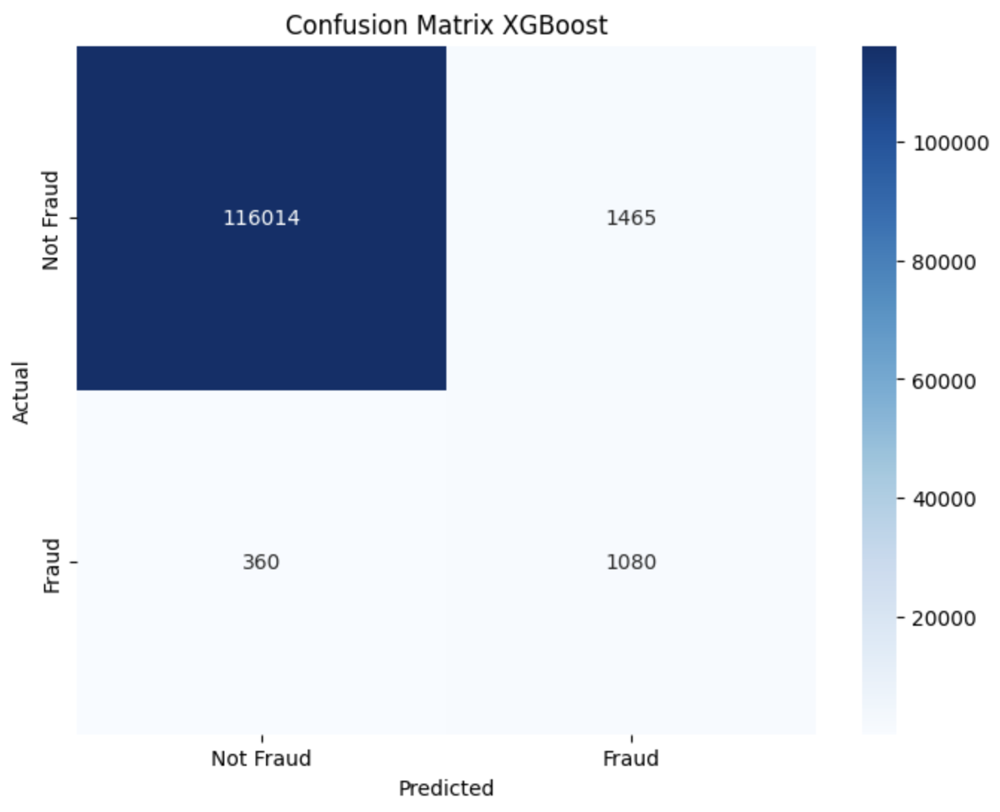
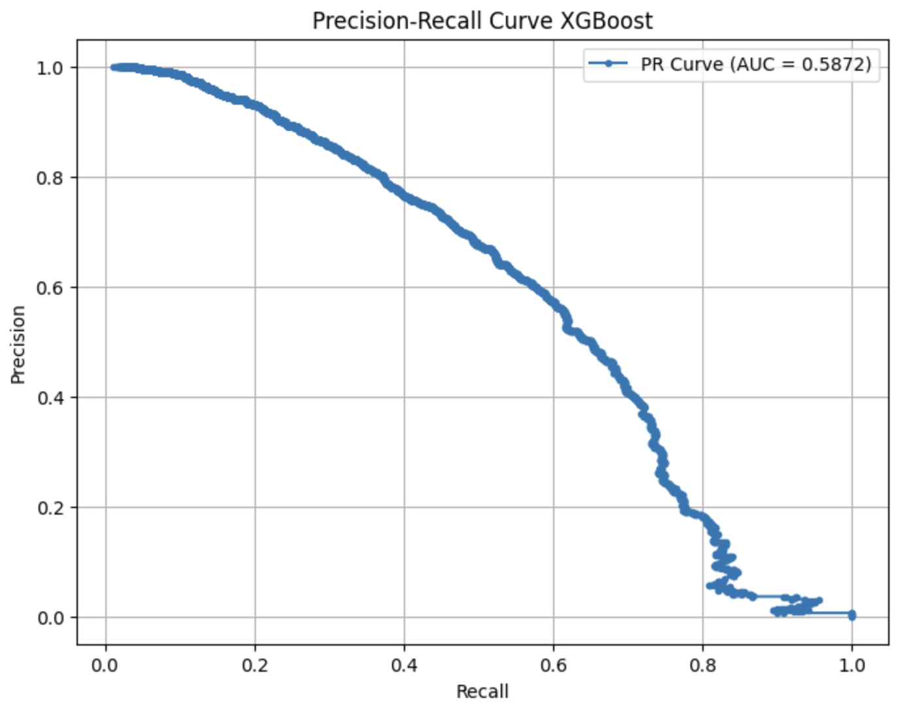
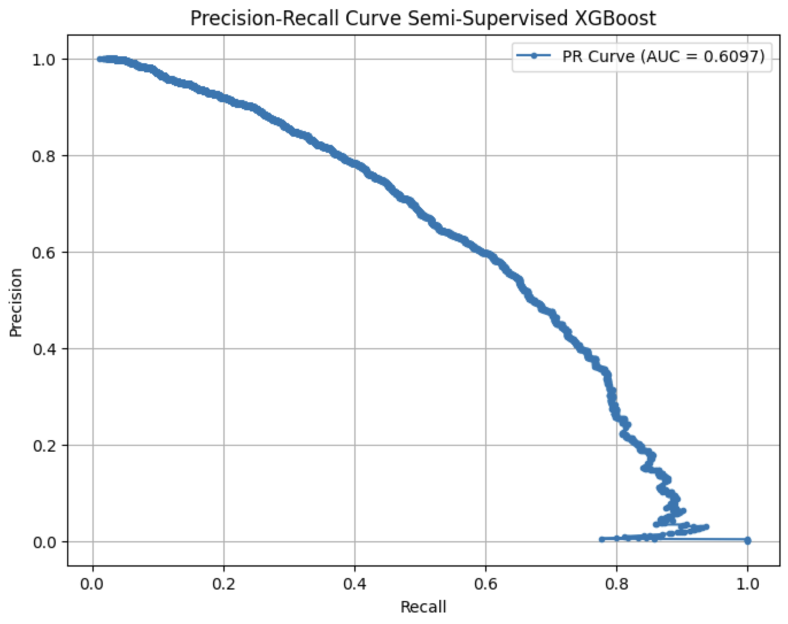

# Enhancing Money Laundering Detection with Semi-Supervised Learning
Timo Schouw

June 13, 2024

Master Thesis (Code)

Master Applied AI

Applied University of Amsterdam

## Content
This repository contains:

1. [data_processing](data_processing.ipynb): Data Pre-processing and Splitting  
2. [Analysis 1](analysis_1.ipynb): Isolation Forest & Semi-Supervised Isolation Forest
3. [Analysis 2](analysis_2.ipynb): XGBoost & Semi-Supervised XGBoost
4. [Analysis 3](analysis_3.ipynb): Semi-Supervised Isolation Forest & Semi-Supervised XGBoost
5. [SSIF](SSIF.py): Python file with Semi-Supervised Isolation Architecture
6. [The Thesis Report](Timo_Schouw_Master_Thesis_Final_Report.pdf): Enhancing Money Laundering Detection with Semi-Supervised Learning

## Table of Contents

- [Explanation](#explanation)
- [Dataset](#dataset-banksim)
- [Libraries](#libraries)
- [Contributors](#contributors)
- [Literature](#literature)

## Explanation
This research consisted of two separate studies: the qualitative research and the quantitative research. The quantitative research involved the use of three analyses using four models to classify fraudulent transactions. The method used in Python can be found in this repository. 

First, data processing and splitting were performed to add, remove, scale and transform features so that the data were ready for training, evaluation and testing. Then the three analyses were conducted. Each analysis compared two models, and for each model, the best-performing model was tested on the test dataset. The figures used in the thesis have been added here so that it is clear in which file they were created.

**Important Note:**

The test results were calculated in [Analysis_1](#analysis-1-isolation-forest--semi-supervised-isolation-forest) and [Analysis_2](#analysis-2-xgboost--semi-supervised-xgboost), because the results of those analyses determined the best performing models. 

### Data Processing
The [data_processing](data_processing.ipynb) notebook covers the initial steps of data pre-processing, including cleaning, normalization, and splitting the dataset into training and testing sets. 




### Analysis 1: Isolation Forest & Semi-Supervised Isolation Forest
The [Analysis 1](analysis_1.ipynb) notebook explores the use of Isolation Forest and a semi-supervised version of Isolation Forest for detecting fraudulent transactions.







### Analysis 2: XGBoost & Semi-Supervised XGBoost
The [Analysis 2](analysis_2.ipynb) notebook examines the application of XGBoost and its semi-supervised XGBoost for the same task.







### Analysis 3: Semi-Supervised Isolation Forest & Semi-Supervised XGBoost
The [Analysis 3](analysis_3.ipynb) notebook integrates both semi-supervised Isolation Forest and semi-supervised XGBoost to enhance detection performance.


### SSIF Architecture
The [SSIF](SSIF.py) file contains the implementation of the Semi-Supervised Isolation Forest (SSIF) architecture used in the analyses.

## Dataset: Banksim

The scientific transactional dataset introduced by E. A. Lopez-Rojas and S. Axelsson in [1], Banksim, was used in this research. Banksim is created through an agent-based simulator on a sample of aggregated transactional data provided by a bank in Spain.

The dataset leveraged statistical and Social Network Analysis (SNA) of relations between merchants and customers. It contains approximately six months of transactions, resulting in 594,643 rows, of which 587,443 are labeled normal and 7,200 are labeled fraudulent (1.21%). The dataset includes six main features: Step, Customer, Merchant, Category, Amount, and Fraud. The step represents a day of commercial activity, and the dataset contains 180 steps. The customer is the one who performs the transaction, and each customer has a unique ID with a related zip code, age, and gender. To comply with privacy requirements, age and gender were removed from the dataset. The merchant is the receiver of the transaction, and each unique merchant has an ID and a related zip code, which was also removed to meet privacy requirements. The category entity shows the purchased service or goods category with the corresponding transaction. Fifteen different categories were used in the dataset. The transaction amount shows the exact amount in euros, and the fraud feature indicates whether the transaction was fraudulent or not.

Banksim can be downloaded [here](https://www.kaggle.com/datasets/ealaxi/banksim1).

## Libraries

```sh
import pandas as pd
import numpy as np
from sklearn.ensemble import IsolationForest
from sklearn.metrics import confusion_matrix, classification_report, accuracy_score, precision_score, recall_score, average_precision_score, roc_curve, precision_recall_curve, auc
from sklearn.model_selection import train_test_split, GridSearchCV, cross_val_score
from sklearn.preprocessing import MinMaxScaler
from sklearn.metrics import make_scorer, ConfusionMatrixDisplay
import matplotlib.pyplot as plt
import xgboost as xgb
from sklearn.utils import resample

np.random.seed(42)

```

## Contributors

Writer: Timo Schouw (timo.schouw@gmail.com)

Supervisor / Assessor: Kees van Montfort

2nd Assessor: Marcio Fuckner

## Literature

[1] [BankSim: A Bank Payment Simulation for Fraud Detection Research](https://www.researchgate.net/publication/265736405_BankSim_A_Bank_Payment_Simulation_for_Fraud_Detection_Research)